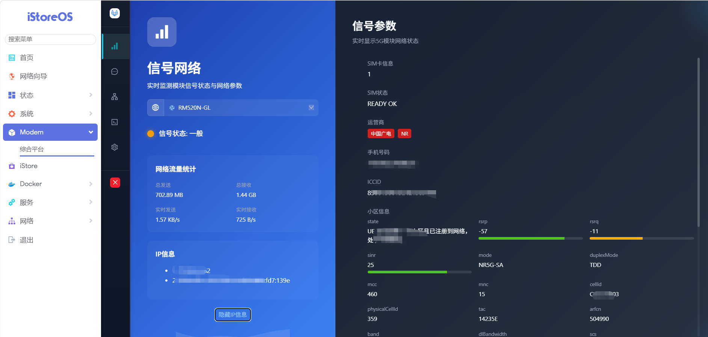

# 5G模组全能管理插件（modem-5g）
# luci-app-modemserver

**有房大佬出品** | **AAYY兄 整理提供** | **v1.1.5** | 仅供测试研究

[English](README_EN.md) | [中文](README.md)

适用于 ImmortalWrt / OpenWRT | ARM64 (aarch64_generic) | Quectel RM520N-GL 及全系列 5G 模组


---

## 图片展示



---

## 安装方式

### 方式一：GitHub 克隆安装

```bash
git clone https://github.com/a10463981/modem-5g.git /tmp/modem-5g
cd /tmp/modem-5g
chmod +x install.sh && ./install.sh
```

### 方式二：文件ipk 安装
## ⚠️ 安装必读 — 必须按顺序执行以下命令

本插件的 `/etc/init.d/usbmode` 和 `/etc/usb-mode.json` 与新系统 `usb-modeswitch` 包存在文件冲突（本包为 5Gmoden模块定制版，usb-modeswitch内容与系统通用版不同）。

**因此必须先执行第一步卸载冲突包，再执行第二步覆盖安装：**

```bash
# 【第一步】先卸载冲突的 usb-modeswitch（必须）
opkg remove usb-modeswitch --force-depends

# 【第二步】安装本插件，必须加 --force-overwrite（必须）
opkg install /tmp/upload.ipk --force-overwrite
```

> ⚠️ 两步都要执行，缺一不可！仅执行第二步会报错 "usb-modeswitch * conflict"。

## 📥 下载说明 — 选择对应架构版本

| 文件名 | 架构 | 适用情况 |
|--------|------|---------|
| `luci-app-modemserver_1.*.*_all-all.ipk` | **ALL（全架构通用）** | ✅ **不知道选哪个就下载这个**，支持 aarch64 / x86_64 / armv7，安装时自动判断 |
| `luci-app-modemserver_1.*.*_aarch64_cortex-a53.ipk` | ARM64 | iStoreOS、ImmortalWrt ARM64 路由器 |
| `luci-app-modemserver_1.*.*_x86_64.ipk` | x86_64 | x86 软路由 |
| `luci-app-modemserver_1.*.*_arm_cortex-a15_neon-vfpv4.ipk` | ARMv7 | 32位 ARM 路由器（此架构不推荐） |

> 💡 普通用户推荐下载 `all-all.ipk`，一个文件支持所有架构，安装时自动匹配。

**卸载命令：**
```bash
opkg remove luci-app-modemserver
```

---

## 快速导航

| 文档 | 说明 |
|------|------|
| [TROUBLESHOOTING.md](TROUBLESHOOTING.md) | **问题排查手册** — 包含所有已知问题、原因、解决方法、完整文件路径、权限说明 |

> 💡 **将 TROUBLESHOOTING.md 交给 AI，可快速定位和解决各类问题**

适用于 ImmortalWrt / OpenWRT | ARM64 (aarch64_generic) | Quectel RM520N-GL 及全系列 5G 模组

---

## 免责声明

> ⚠️ **仅供学习与测试使用**
>
> 本插件由 [AAYY兄 www.aayy.top](http://www.aayy.top) 整理反编译提供，仅限于技术研究与测试目的。
>
> 本插件涉及的所有技术内容均来自公开渠道，版权归原始开发者所有。如有任何侵权行为，请及时联系，将在第一时间删除处理。
>
> **禁止用于任何商业用途或非法用途。**

---

## 功能特性

| 组件 | 说明 | 端口 |
|------|------|------|
| **modemserver** | Go + Vue.js Web 管理界面 | 8080 |
| **quectel-CM-M** | Quectel 官方 QMI 拨号连接管理器 | — |
| **sendat** | AT 命令发送工具 | — |
| **tom_modem** | 模组诊断与管理工具 | — |

### 核心能力

- ✅ QMI WWAN 驱动自动绑定
- ✅ 开机自动 5G 拨号上网（IPv4）
- ✅ Web UI 管理模组（信号/运营商/流量等）
- ✅ USB 热插拔自动检测（插入启动，拔出停止）
- ✅ AT 命令交互（信号/运营商/小区/重启等）
- ✅ 进程守护（异常自动重启）

---

## 支持的模组

| 品牌 | 型号 | VID:PID | 备注 |
|------|------|---------|------|
| Quectel | RM520N-GL | 2c7c:0801 | ✅ 已测试 |

> 理论上所有使用 QMI 协议的 Quectel 5G/4G 模组均支持。

---

## 硬件要求

- **路由器**：ImmortalWrt 23.05.3 / OpenWRT 23.05+
- **架构**：ARM64 (aarch64_generic)
- **USB**：USB 3.0 端口（推荐）
- **模组**：Quectel 5G 模组（USB 模式）

---

## 目录结构

```
modem-5g/
├── Makefile                      # OpenWRT IPK 编译文件
├── README.md                     # 本文件
├── README_EN.md                  # English version
├── modem-5g-v1.0.0.zip         # 完整安装包（推荐下载）
├── install.sh                   # 一键安装脚本
├── uninstall.sh                 # 卸载脚本
│
├── .github/
│   └── workflows/
│       └── build.yml            # GitHub Actions 自动编译
│
├── luasrc/                      # LuCI Web 界面
│   ├── controller/admin/
│   │   └── modemsrv.lua         # LuCI 控制器
│   ├── model/network/
│   │   └── proto_modemmanager.lua
│   └── view/modemsrv/
│       ├── 5Gmodem.htm
│       └── 5Gmodeminfo.htm
│
├── root/etc/                    # 系统配置文件
│   ├── init.d/
│   │   ├── usbmode
│   │   ├── modemserver
│   │   └── modemsrv_helper
│   ├── hotplug.d/usb/
│   │   └── 20-modem_mode
│   └── rc.d/
│       ├── S20usbmode
│       ├── S99modemserver
│       └── S99modemsrv
│
└── files/usr/bin/               # 二进制程序
    ├── modemserver
    ├── quectel-CM-M
    ├── sendat
    └── tom_modem
```

---

## 自动启动逻辑

```
┌─────────────────────────────────────────────────────┐
│  第一层：系统启动（boot）                             │
│  /etc/rc.d/S20usbmode  (START=20)                  │
│    → 检测 Quectel模组 VID:PID                        │
│    → 确保 wwan0 设备存在且 UP                       │
│                                                       │
│  /etc/rc.d/S99modemsrv  (START=99)                 │
│    → 启动 quectel-CM-M -s cmnet 自动拨号           │
│                                                       │
│  /etc/rc.d/S99modemserver (START=99)               │
│    → 启动 modemserver（Web UI，端口 8080）          │
└───────────────────────────┬───────────────────────────┘
                            │  USB 插拔
                            ▼
┌─────────────────────────────────────────────────────┐
│  第二层：USB 热插拔（hotplug）                       │
│  /etc/hotplug.d/usb/20-modem_mode                 │
│    → 插入检测到 Quectel → 启动拨号                  │
│    → 拔出 → 断开连接                               │
└─────────────────────────────────────────────────────┘
```


### Web 管理界面

- **直接访问**：http://192.168.1.1:8080
- **通过 LuCI**：网络 → 5G Modem → 综合平台

### AT 命令示例

```bash
# 查询信号强度
sendat /dev/ttyUSB2 AT+CSQ

# 查询运营商信息
sendat /dev/ttyUSB2 AT+COPS?

# 查询小区信息
sendat /dev/ttyUSB2 AT+CGNINFO

# 重启模组
sendat /dev/ttyUSB2 AT+CFUN=1,1
```

### 服务管理

```bash
# 查看服务状态
ps | grep -E "modemserver|quectel-CM"

# 查看网络接口
ip addr show wwan0

# 查看日志
logread | grep -E "usbmode|modem|hotplug" | tail -20

# 重启服务
/etc/init.d/modemserver restart
/etc/init.d/modemsrv_helper start
```

---

## 卸载说明

```bash
chmod +x uninstall.sh
./uninstall.sh
```

---

## 常见问题

**Q: 模组已插入但 quectel-CM 没有自动连接？**
```bash
lsusb | grep 2c7c
ip link show wwan0
/etc/init.d/modemsrv_helper start
```

**Q: modemserver Web 页面打不开？**
```bash
netstat -tlnp | grep 8080
ps | grep modemserver
logread | grep modemserver | tail -10
```

**Q: 如何查看拨号是否成功？**
```bash
ip addr show wwan0
ip route | grep wwan0
ping -I wwan0 8.8.8.8
```

---

## 更新日志

### v1.0.0 (2026-03-25)

- 初始版本发布
- 支持 Quectel RM520N-GL（2c7c:0801）
- modemserver Web UI（Go + Vue.js，端口 8080）
- quectel-CM-M 拨号管理（QMI IPv4）
- sendat / tom_modem AT 命令工具
- 完整 LuCI 管理界面集成
- USB 热插拔自动检测
- AAYY兄整理提供

---

## 致谢

- **原始开发者**：有房大佬 — 核心技术贡献者
- **整理提供**：AAYY兄 [www.aayy.top](http://www.aayy.top)

---

## 许可证

GPL-3.0
